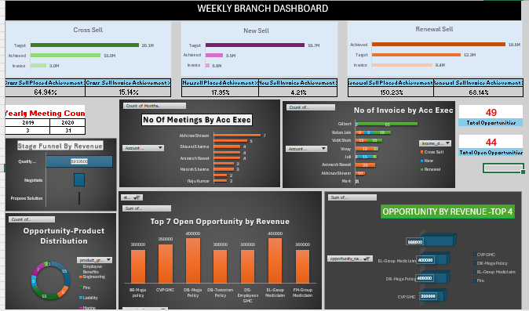

# Insurance Analytics Project
## Overview
Insurance Analytics (site-level)data  provides insights on sales, employee productivity, business opportunities 
and policy data. It focuses on key KPI’s such as placed achievement, invoice achievement, no of meetings attended, 
revenue by stages ,top open opportunities by product, etc over Cross Sell, Renewal sell and New Sell.

---
## Objective
- To provide a comprehensive view of the insurance business performance across various selling channels (Cross Sell, New Sell, Renewal), highlighting achievements, invoices, and opportunity metrics
- Analyse performance against set sales targets
- Monitor invoice generation and budget utilization
- Evaluate opportunity distribution by product and revenue
- Track performance, meetings and activities of account executives

## Tools and Technologies
- **Microsoft Excel** - for initial data cleaning and analysis
- **MySql** - For data storage,querying and aggregation.
- **PowerBI** - For creating interactive dashboards
- **Tableau** - for creating advanced interactive dashboards .

## Datasets
- CRM system for opportunities and meetings
- Finance systems for budget and invoice tracking
- Product portfolio records

## Dashboard View
## Excel

## SQL

## Power BI

## Tableau

## Actionable Insights 
- Focus on boosting New Sell conversions
- Improve invoice realization for Cross and New Sell
- Leverage successful Renewal strategies across other categories
- Prioritize high-value opportunities (top 4)

## Target Demographic 
- Increase Sales Efficiency - Optimize resource allocation based on real-time performance insights
- Boost Opportunity Conversion - Identify and act on high-value deals through improved funnel visibility.
- Improve Invoice Realization Rate - Close the gap between placed and invoiced revenue, especially in New Sell
- Enhance Decision-Making - Empower stakeholders with data-backed insights for faster actions

## Project Files 
All Files are available in Project Repository 
- Can also refer from google drive - https://drive.google.com/drive/folders/1BtL50WqX1pgTuGwwCqi79pEMH1A4Txrp?usp=drive_link

